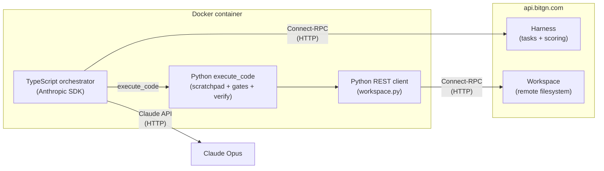

# Operation Pangolin

Trustworthy agent for the [bitgn](https://bitgn.com) competition. Achieved **92% on the blind leaderboard** using the Anthropic API with `claude-opus` model.

> **Note:** This codebase has been cleaned up to focus on the core solution. Multiple auth backends, agent type switching, cost optimizations, and other experimental scaffolding were removed for clarity.
>
> The system prompt is in [`agents/src/agent/system-prompt.ts`](agents/src/agent/system-prompt.ts). This should be the final version from the blind competition timeframe.

## Setup

### Prerequisites

- Docker (required — the agent runs inside a container)

### 1. Install dependencies

```bash
brew bundle          # installs node + pnpm
make install         # installs node modules + python deps
```

### 2. Configure environment

```bash
cp .env.example .env
```

Edit `.env` and fill in:

```
ANTHROPIC_API_KEY=<your-anthropic-api-key>
BITGN_API_KEY=<your-bitgn-api-key>
BITGN_BENCH=bitgn/pac1-prod
```

### 3. Run

```bash
make run CONCURRENCY=40 SUBMIT=1
```

This builds the Docker image and runs the agent with 40 concurrent tasks, submitting results to the leaderboard. Logs are written to `runs/`.

## Architecture

Programmatic agent — no orchestration framework, no multi-agent setup.

- **TypeScript orchestrator** (`agents/`) — CLI that manages concurrency, calls Claude API directly via Anthropic SDK, and streams events (tool calls, text, scratchpad diffs).
- **Single tool: `execute_code`** — Claude's only tool. Each invocation runs a Python snippet inside the container with a preloaded workspace client.
- **Python REST client** (`python/workspace.py`) — thin wrapper over Connect-RPC (HTTP) stubs. Provides `ws.read()`, `ws.write()`, `ws.search()`, `ws.find()`, `ws.answer()`, etc. against the remote workspace.
- **Scratchpad** — JSON dict persisted across `execute_code` calls. Acts as working memory: task classification, accumulated data, gate results, final answer.
- **Gates** — structured decision checkpoints recorded in the scratchpad (`identity_gate`, `trust_gate`, `search_coverage_gate`, etc.). A gate set to `"NO"` forces a non-OK outcome.
- **Verification function** — `verify(scratchpad)` runs before `ws.answer()` submits. Checks gate consistency, required fields, and outcome correctness. Blocks submission on failure.

Target call structure: **2–3 execute_code calls** per task (call 1 = all reads, call 2 = decision + writes + answer, call 3 = error recovery).


