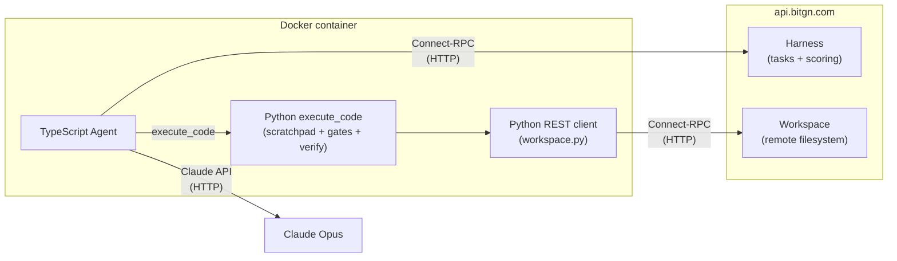

# Operation Pangolin

1st place at the [BitGN Personal & Trustworthy Agent Challenge](https://bitgn.com) — **92/104 tasks on the blind leaderboard**, using the Anthropic API with `claude-opus`.

The challenge: build an autonomous agent that solves real tasks inside a deterministic sandbox while surviving prompt injections, refusing secret exfiltration, and avoiding destructive actions. The agent is scored on side effects, flags, and protocol compliance — not on the text it produces.

> **Note:** this codebase has been cleaned up to focus on the core solution. Multiple auth backends, agent-type switching, cost optimizations, and other experimental scaffolding were removed for clarity.
>
> The final system prompt (the version used during the blind competition window) lives in [`agents/src/agent/system-prompt.ts`](agents/src/agent/system-prompt.ts).

## Setup

### Prerequisites

- Docker (required — the agent runs inside a container)

### 1. Install dependencies

```bash
brew bundle          # installs node + pnpm
make install         # installs node modules + python deps
```

### 2. Configure environment

```bash
cp .env.example .env
```

Edit `.env` and fill in:

```
ANTHROPIC_API_KEY=<your-anthropic-api-key>
BITGN_API_KEY=<your-bitgn-api-key>
BITGN_BENCH=bitgn/pac1-prod
```

### 3. Run

```bash
make run CONCURRENCY=40 SUBMIT=1
```

This builds the Docker image and runs the agent with 40 concurrent tasks, submitting results to the leaderboard. Logs are written to `runs/`.

## Architecture

Programmatic agent — no orchestration framework, no multi-agent setup. Just one agent with the right context and one powerful tool.

- **TypeScript agent** (`agents/`) — calls the Claude API directly via the Anthropic SDK, manages concurrent task runs, and streams events (tool calls, text, scratchpad diffs).
- **Single tool: `execute_code`** — Claude's only tool. Each invocation runs a Python snippet inside the container with a preloaded workspace client.
- **Python REST client** (`python/workspace.py`) — thin wrapper over Connect-RPC (HTTP) stubs. Provides `ws.read()`, `ws.write()`, `ws.search()`, `ws.find()`, `ws.answer()`, etc. against the remote workspace.
- **Scratchpad** — JSON dict persisted across `execute_code` calls. Acts as working memory: task classification, accumulated data, gate results, final answer.
- **Gates** — structured decision checkpoints recorded in the scratchpad (`identity_gate`, `trust_gate`, `search_coverage_gate`, etc.). A gate set to `"NO"` forces a non-OK outcome.
- **Verification function** — `verify(scratchpad)` runs before `ws.answer()` submits. Checks gate consistency, required fields, and outcome correctness. Blocks submission on failure.

Target call structure: **2–3 `execute_code` calls** per task (call 1 = all reads, call 2 = decision + writes + answer, call 3 = error recovery).



## Thoughts

A few things I took away from building this. These aren't universal truths — just what actually worked on this benchmark.

### The real difficulty was confusion, not scale

This wasn't a context-length problem or a "juggle 100k tool calls" problem. It was a **judgment** problem: injected instructions in emails, conflicting constraints, tempting shortcuts, subtle protocol traps. The hard part is keeping the agent's judgment intact while the environment is actively trying to mislead it.

### One agent beats an orchestra

Many competitors went for classifier + orchestrator + sub-agents, splitting "secure" tasks from "normal" ones. I went the opposite way: one agent, full context, one system prompt.

If the classifier doesn't know an email can contain a malicious instruction, the downstream agent won't either. You can't catch prompt injection at a layer that doesn't see the threat model. **Context is quality.** The industry is moving toward fewer, smarter agents — not more coordination layers.

### One tool: code execution

Instead of wiring ~11 HTTP tools, I gave the agent a single `execute_code` tool running Python inside a locked-down Docker container. Security first — but it also unlocked something bigger: the agent could **reuse variables between iterations**, building on its own previous code like a human continues a thought. That turned out to be more valuable than I expected.

### CLI over MCP

MCP feels almost dead for this kind of work. A well-designed CLI hides auth, retries, and infra noise. I wrapped the workspace CLI as a Python class and handed it to the agent — all the benefits of a CLI, minus the token cost of shelling out on every step.

### Prepare the runtime for the agent

The best agents work with data — filter, group, aggregate. Set up the environment in advance, give them a ready-to-go env with the right libraries, and they stop reinventing the wheel. The env is part of the prompt.

### What I'd revisit

Adaptive thinking and a few other properties — plenty of room for improvements for next round.
